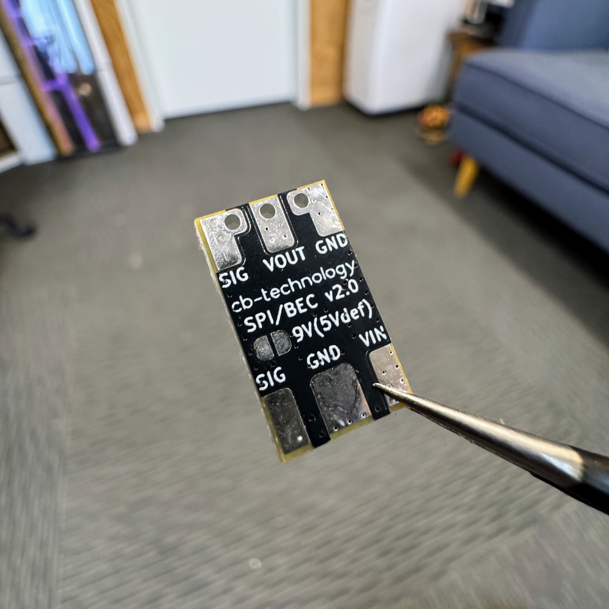
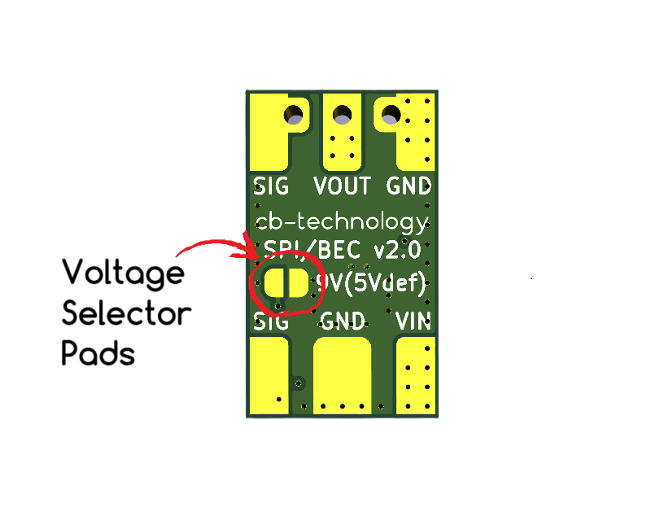
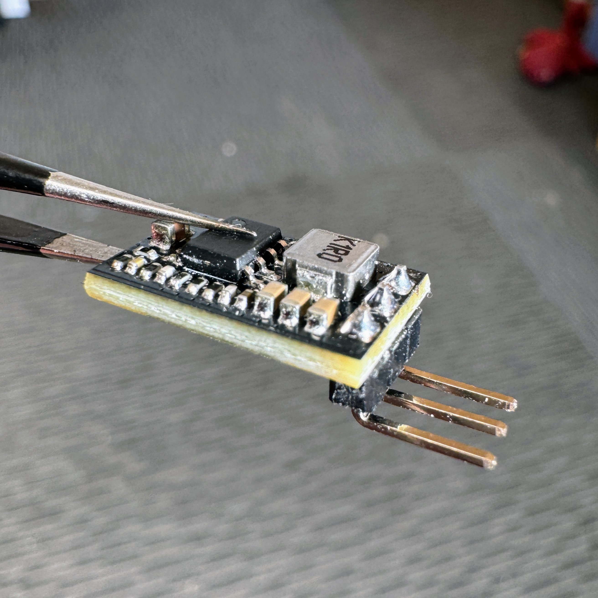
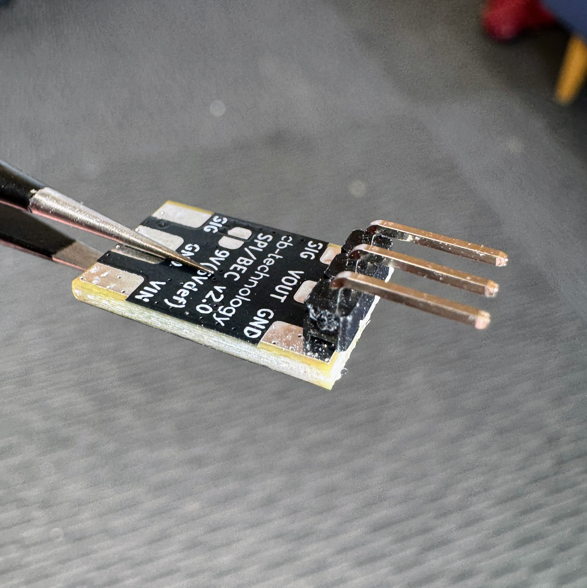
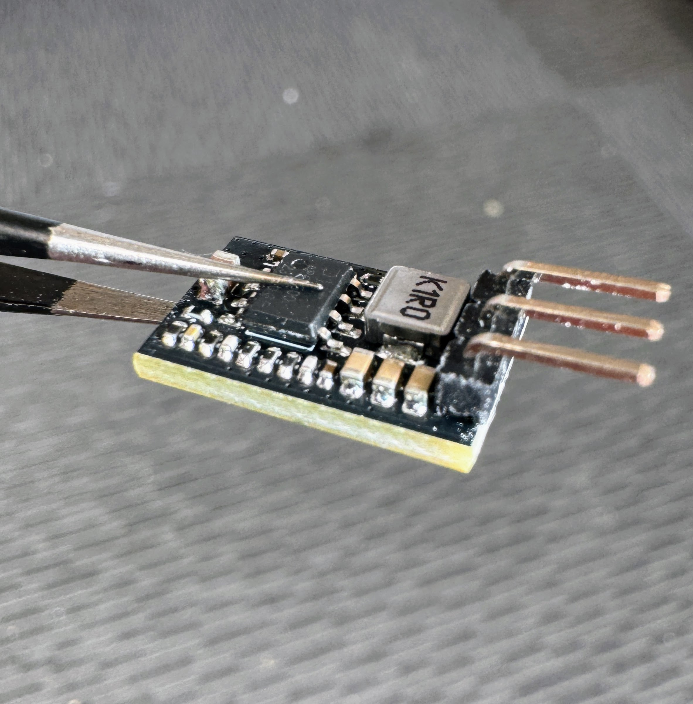
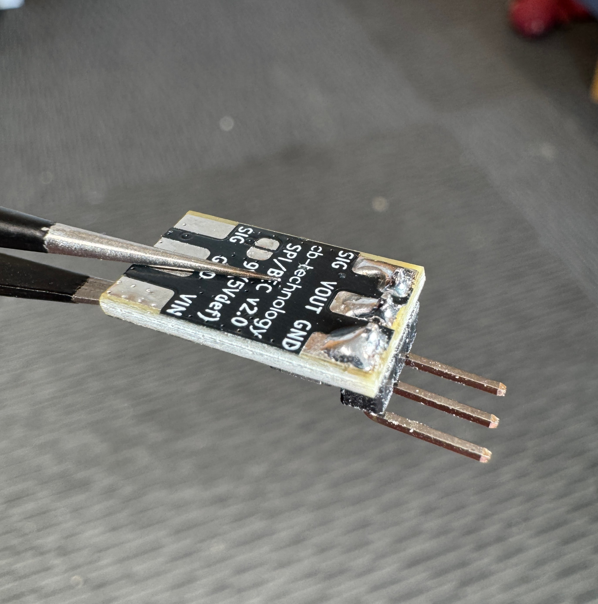
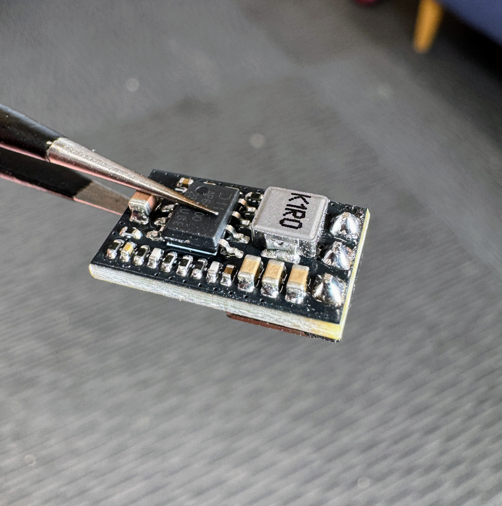
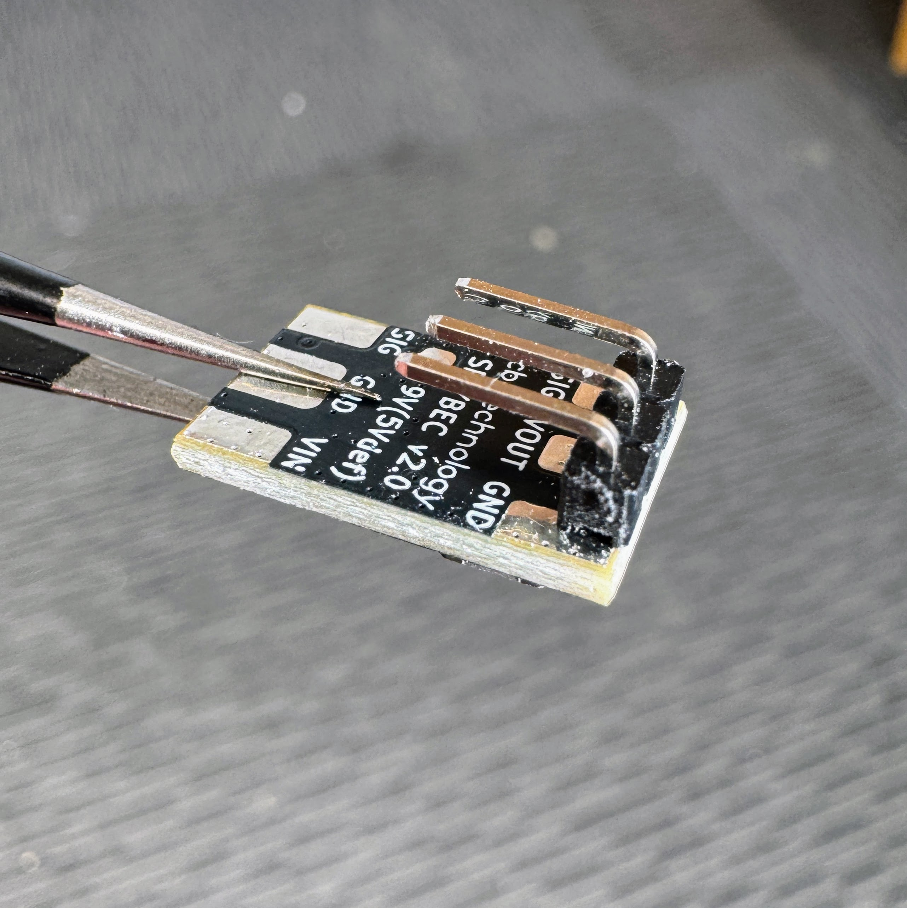
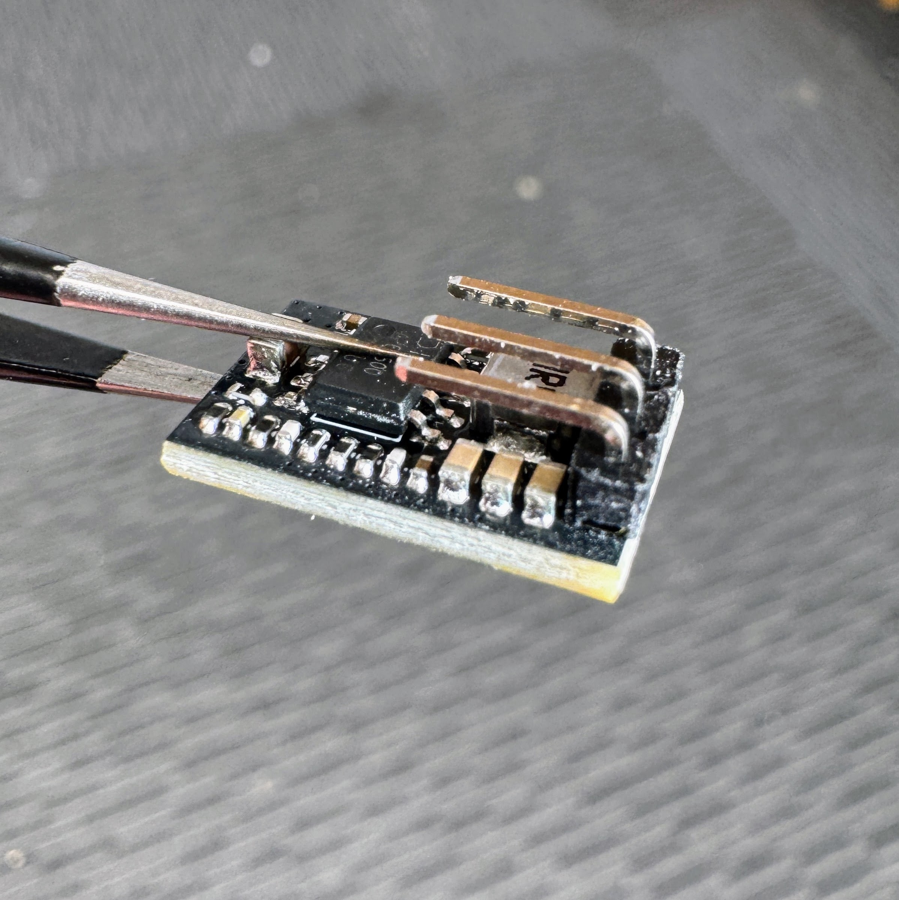
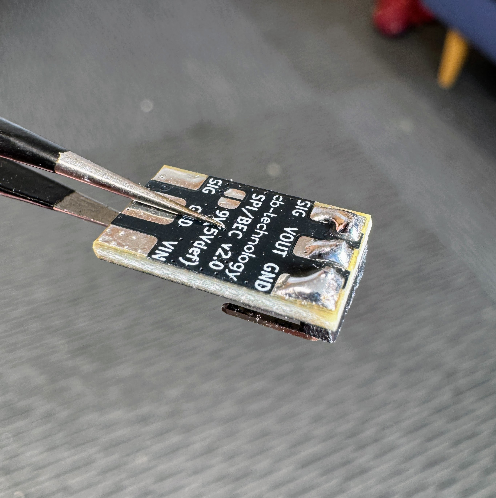

# SERVO POWER INJECTOR (SPI) / BATTERY ELIMINATOR CIRCUIT (BEC) - v2.0

 

SERVO POWER INJECTOR (SPI) is a twist on the standard Battery Eliminator Circuit (BEC), providing the expected light-weight high-current power supply functionality while adding the option to splice a control signal directly into a standard servo connector.

This functionality means this SPI/BEC product can operate in 2 distinct modes. 
1. Standard BEC Mode: Providing a stable 5V or 9V output voltage for any requiring electronc, such as radios.
2. Power Injector Mode: Includes the same 5V/9V power output but also integrates the SIG pin. Now passing the signal from the input pad and injecting it into the standard factory servo connector output. Useful for powering and connecting signals to servos and ESC inputs without modification of the factory connectors.

This is a [New Zealand](https://www.google.co.nz/maps/place/Christchurch+New+Zealand) based product by [cb-technology](https://www.cb-technology.co.nz/), Connor Benton.

## FEATURES

- Small form-factor and lightweight design to be easily substituted into any new or exiting systems.
- Selectable 5V or 9V voltage outputs.
- Wide input voltage range.
- High current rating to allow reliable operation when powering hobby servo's.
- Inline connection layout (IN one side OUT the other)
- Integrated thermal and current limiting.
- Red power LED to display arming of downstream electronics.
- Signal track protection. Small series resistor added to the signal track to minimise cascading failures in-case of a fault downstream.

## SPECIFICATIONS
- **Dimensions:** 10x16x4 mm
- **Weight:** 3g
- **Voltage Input:** 6-33.6 V (2-8S LiPo)
- **Voltage Output:** 5V *default* (9V *selectable*)
- **Current - Rated:** 3.5 A
- **Current - Max:** 5 A
- **Connector - Input:** Solder Pads
- **Connector - Output:** Solder Pads or 3-pin Pin Header (Standard Servo Connector)

## CONNECTION DIAGRAM

### Mode: Standard BEC
 

### Mode: Servo Power Injector
 

## OUTPUT VOLTAGE SELECTION

On the underside of the board there are two adjacent cemicircular pads beside the label *9V(5Vdef)* which control the output voltage.

 

### 5V

Leave pads unsoldered (default from factory)

 

### 9V

Use a soldering iron to bridge pads with solder

 

## SERVO CONNECTOR ORIENTATION

When soldering the 3-pin Pin Header for use with a servo ther are 4 orientations that work with the privided right angle header

### Connector Orientation 1

  

### Connector Orientation 2

  

### Connector Orientation 3

  

### Connector Orientation 4

  

## DISCLIAMER

This product, and all other cb-technology products, are intended for use in hobby projects, and for educational and experimental uses. These devices are not suitable for any application where human life or health or significant property value depend on their proper operation. cb-technology ltd are not responsible for any loss or damage incurred by the operation or failure of this product or any others. The specifications listed are accurate to the best of our knowledge but are not guaranteed in any way. The buyer assumes all responsibility for proper use, testing, and verification of this unit in any application. cb-technology ltd liability is limited to replacement of defective DOA units. By installing and using this unit you are agreeing to these terms. If you do not agree you may return any unused units for a refund.