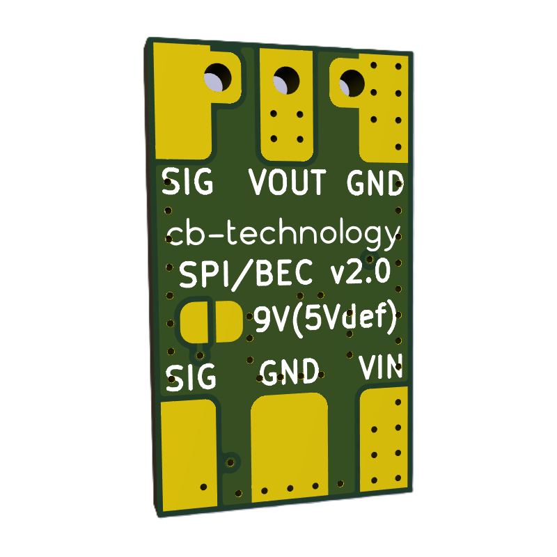
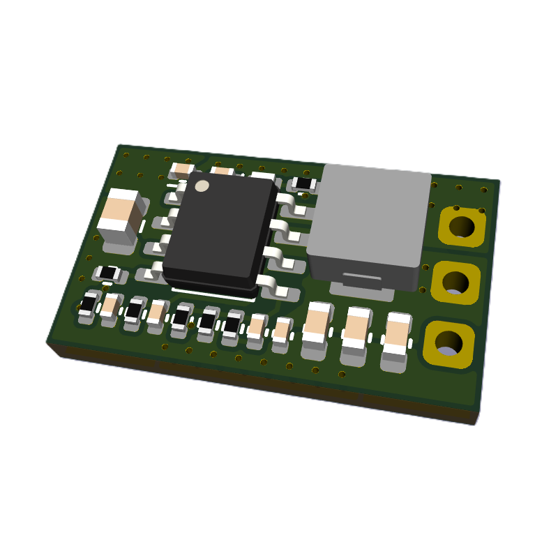

# SERVO POWER INJECTOR v1.0

   

SERVO POWER INJECTOR is a light-weight high-current power supply that splices 5 V regulated power with the radio signal into the standard pinout used by most hobby servo's. Originally this product was designed for combat robotics, but it's suitable for any application that require servos to be driven from an auxilary power source.

This is a [New Zealand](https://www.google.co.nz/maps/place/Christchurch+New+Zealand) based product by [cb-technology](https://www.cb-technology.co.nz/), Connor Benton.

## FEATURES

- High current rating to enable reliabble operation of most hobby servo's.
- Small form-factor and lightweight design to integrate easily into systems that may be size or weight constrained. 
- Integrated thermal and current limiting.
- Power LED on 5V output to indicate when downstream servo is armed.
- Red power LED colour chosen for its visibility.
- Incase of a fault, protection is added to the signal line to minimise cascading failures in the system.

## SPECIFICATIONS
- **Dimensions:** 11x28x4 mm
- **Weight:** 2 g
- **Input Voltage - Rated:** 6-12.6 V (2-3S LiPo)
- **Input Voltage - Absolute Max:** 13.2 V
- **Current - Rated:** 5 A
- **Current - Max:** 6.5 A