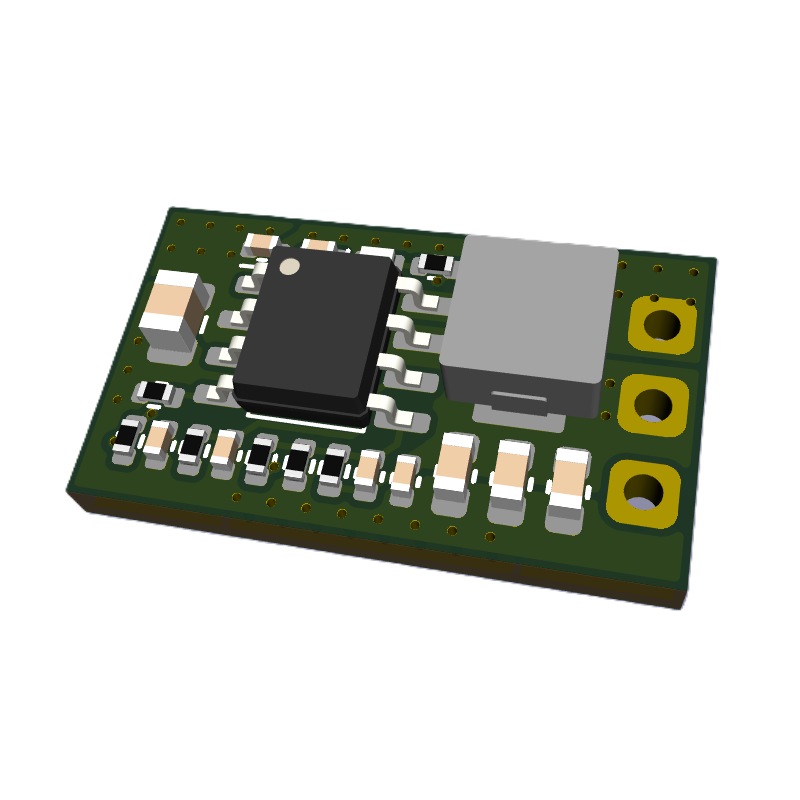

# SERVO POWER INJECTOR (SPI) / BATTERY ELIMINATOR CIRCUIT (BEC) v1.0

   

SERVO POWER INJECTOR is a light-weight high-current power supply that is designed to regulate a battery input down to 5V and splice that into the standard pinout used by most hobby servo's. Originally this product was designed for combat robotics, but it's suitable for any application that requires a compact 5V power supply. 

This product can also be used as a standard Micro BEC by not connecting the signal I/O (just using the Battery input and 5V out).
When operating in this mode, there are no comprimises with size or weight, infact having a higher current output and additional features, when compared to simmilar BEC products.

This is a [New Zealand](https://www.google.co.nz/maps/place/Christchurch+New+Zealand) based product by [cb-technology](https://www.cb-technology.co.nz/), Connor Benton.

## FEATURES

- High current rating to allow reliable operation of most hobby servo's (mitigating risk of brown out).
- Small form-factor and lightweight design to integrate easily into systems that may be size or weight constrained. 
- Integrated thermal and current limiting.
- Power LED on 5V output to indicate when downstream electronics are armed.
- Red power LED colour chosen for its visibility.
- Incase of a fault, protection is added to the signal line to minimise cascading failures in the system.

## SPECIFICATIONS
- **Dimensions:** 11x28x4 mm
- **Weight:** 2 g
- **Input Voltage - Rated:** 6-12.6 V (2-3S LiPo)
- **Input Voltage - Absolute Max:** 13.2 V
- **Current - Rated:** 5 A
- **Current - Max:** 6.5 A