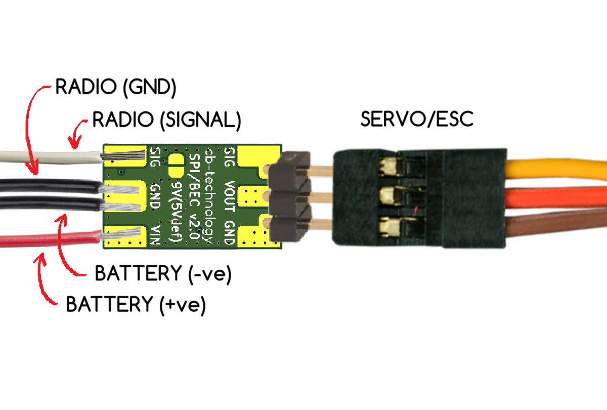

# SERVO POWER INJECTOR (SPI) / BATTERY ELIMINATOR CIRCUIT (BEC) v1.0

   

SERVO POWER INJECTOR (SPI) is a twist on the standard Battery Eliminator Circuit (BEC), providing the expected light-weight high-current power supply functionality while adding the option to splice a control signal directly into a standard servo connector.

This functionality means this SPI/BEC product can operate in 2 distinct modes. 
1. Standard BEC Mode: Providing a stable 5V or 9V output voltage for any requiring electronc, such as radios.
2. Power Injector Mode: Includes the same 5V/9V power output but also integrates the SIG pin. Now passing the signal from the input pad and injecting it into the standard factory servo connector output. Useful for powering and connecting signals to servos and ESC inputs without modification of the factory connectors.

This is a [New Zealand](https://www.google.co.nz/maps/place/Christchurch+New+Zealand) based product by [cb-technology](https://www.cb-technology.co.nz/), Connor Benton.

## FEATURES

- Small form-factor and lightweight design to be easily substituted into any new or exiting systems.
- Selectable 5V or 9V voltage outputs.
- Wide input voltage range.
- High current rating to allow reliable operation when powering hobby servo's.
- Inline connection layout (IN one side OUT the other)
- Integrated thermal and current limiting.
- Red power LED to display arming of downstream electronics.
- Signal track protection. Small series resistor added to the signal track to minimise cascading failures in-case of a fault downstream.

## SPECIFICATIONS
- **Dimensions:** 10x16x4 mm
- **Weight:** 3g
- **Input Voltage - Rated:** 6-33.6 V (2-8S LiPo)
- **Input Voltage - Max:** 36 V
- **Output Voltage:** 5V *default* (9V *selectable*)
- **Current - Rated:** 4 A
- **Current - Max:** 5 A
- **Connector - Input:** Solder Pads
- **Connector - Output:** Solder Pads or 3-pin Pin Header (Standard Servo)

## OUTPUT VOLTAGE SELECTION

### Voltage: 5V
 

### Voltage: 9v
 

## CONNECTION DIAGRAM

### Mode: Standard BEC
 

### Mode: Servo Power Injector
 